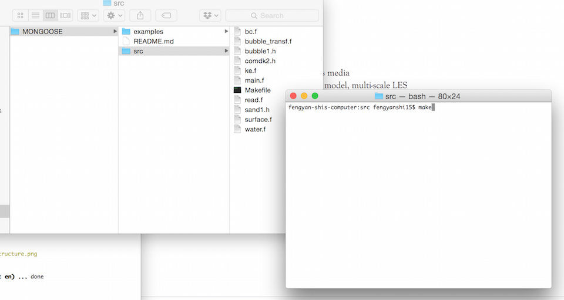

Compile Code
**********************************

* open a linux terminal on your computer
* go to the folder containing the MONGOOSE package
* cd /src
* type *make*, the compiled exe file *mongoose* will be generated in ../bin/. 
* type *make clean* to remove the object files
* type *make veryclean* to remove all the files generated during the compiling process.

.. note:: When the executable file *mongoose* can be used in your work (project) directory if giving the path, or be copied to your work directory.  