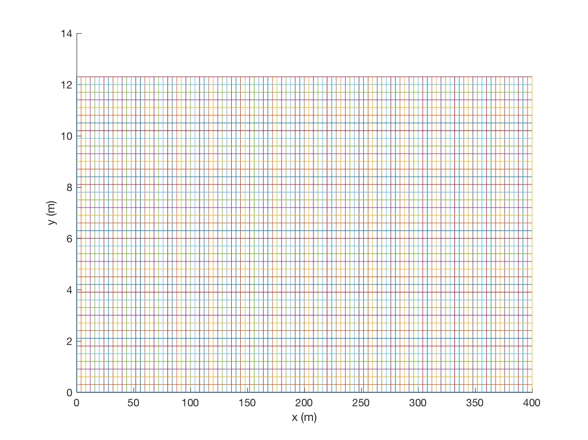
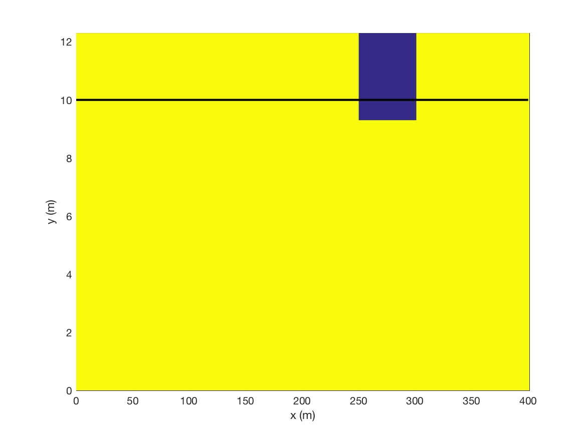
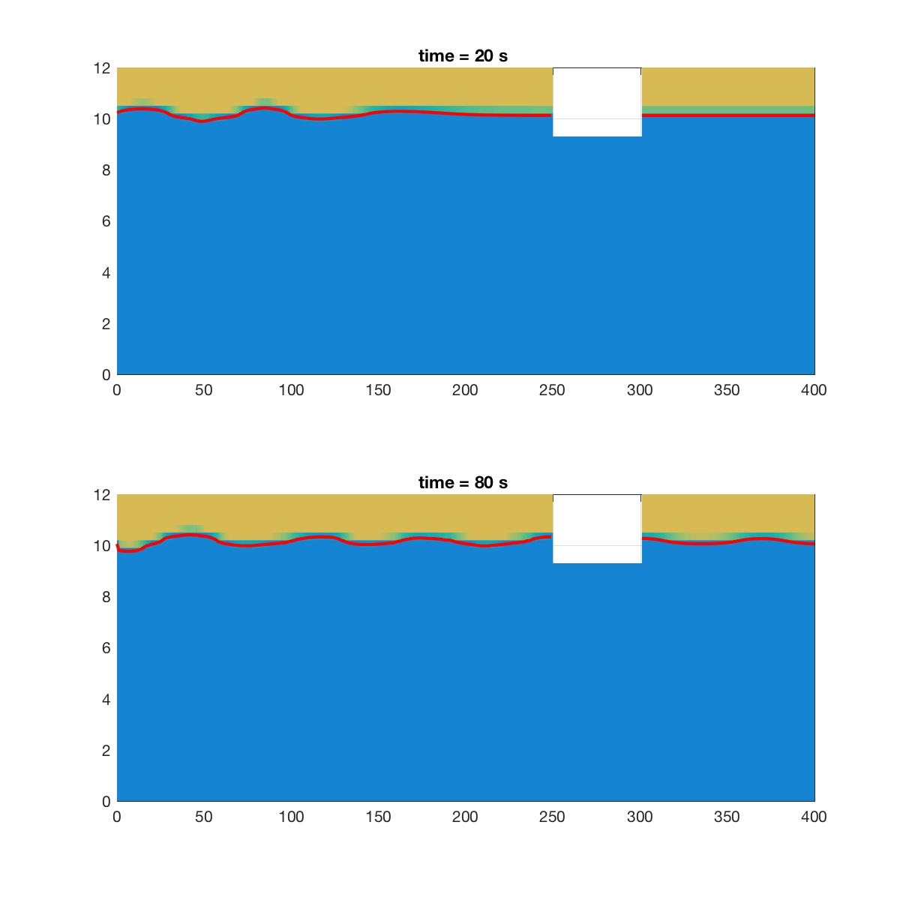

Floating Object with Uniform Grid
************************************

* Numerical

.. code:: ruby

   $numparam
   0.0,0.01,150,0.5,0.05,1.0          = t_start,delt,twfin,prtdt,sfdt,utot
   6,3,1,1   = kl,kr,kt,kb
   $end

**kl = 6** for left boundary wavemaker

* Mesh

.. code:: ruby

   $mesh
   1,0,400.0,200.0,200,200      = nkx,xl(nkx+1),xc(nkx),nxl(nkx),nxr(nky) 
   1.0                         = dxmn(nkx)
   1,0.0,12.0,6.0,20,20       = nky,yl(nky+1),yc(nky),nyl(nky),nyr(nky)
   0.3           =dymn(nky)
   $end

* Free surface

.. code:: ruby

   $freesurf
   1                     =nfrsrf
   0.,0.0                =fa2(nfrsrf),fa1(nfrsrf)
   0.,-1.0               =fb2(nfrsrf),fb1(nfrsrf)
   0.,10.0,1              =fc2(nfrsrf),fc1(nfrsrf),ifh(nfrsrf)
   0.,0.                 =fd2(nfrsrf),fd1(nfrsrf)
   0.,0.                 =fe2(nfrsrf),fe1(nfrdrf)
   0.,0.                 =nxf(nfrsrf),mxf(nfrsrf)
   0.,0.                 =nyf(nfrsrf),myf(nfrsrf)
   10.0                   =flht
   $end

* Obstacle

.. code:: ruby

   $obstcl
   1    = nobstype
   3    = nobs
   0.0 1.00 0.0 0.0    = oa2(nobs),oa1(nobs),ob2(nobs),ob1(nobs)
   0.0,-300.0,1       = oc2(nobs),oc1(nobs),ioh(nobs)
   0.0 1.0 0.0 0.0    = oa2(nobs),oa1(nobs),ob2(nobs),ob1(nobs)
   0.0,-250.0,0       = oc2(nobs),oc1(nobs),ioh(nobs)
   0.0 0.0 0.0 1.0    = oa2(nobs),oa1(nobs),ob2(nobs),ob1(nobs)
   0.0,-9.0,0       = oc2(nobs),oc1(nobs),ioh(nobs)
   $end

* Wave parameters

.. code:: ruby

   $wave parameter$
   0.5,10.0,10.0,4      =ht,dep,depr,wavemk(4:Stokes,5:solitary,24:cnoidal,34:linear) 
   8 1                   =T,areturn
   $end 

