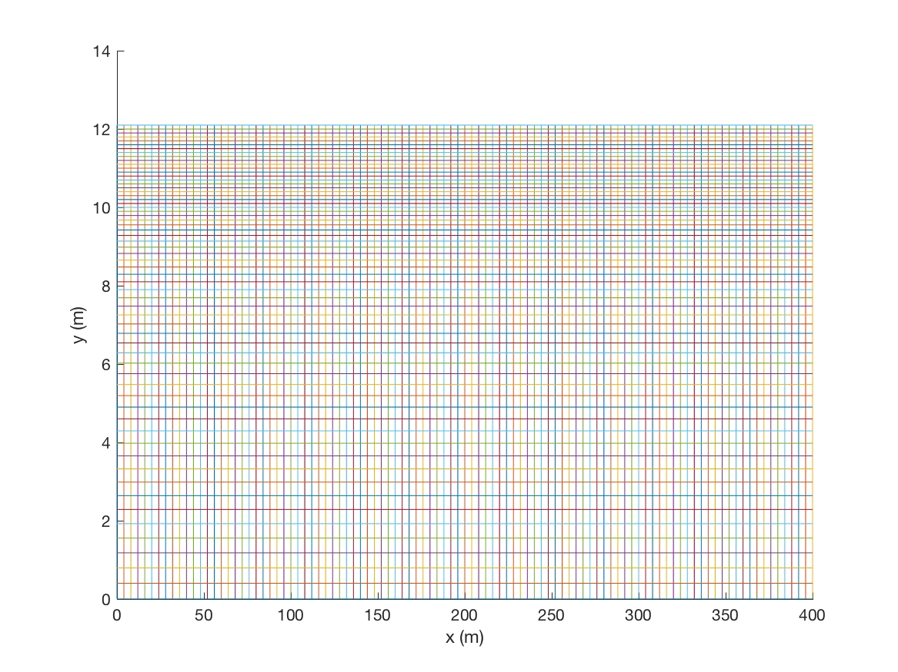
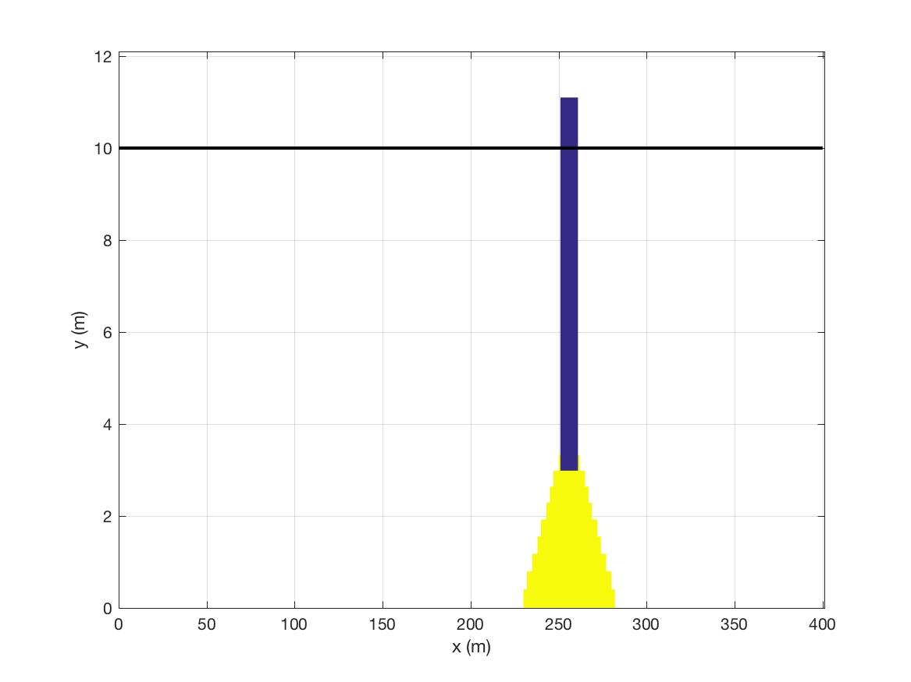
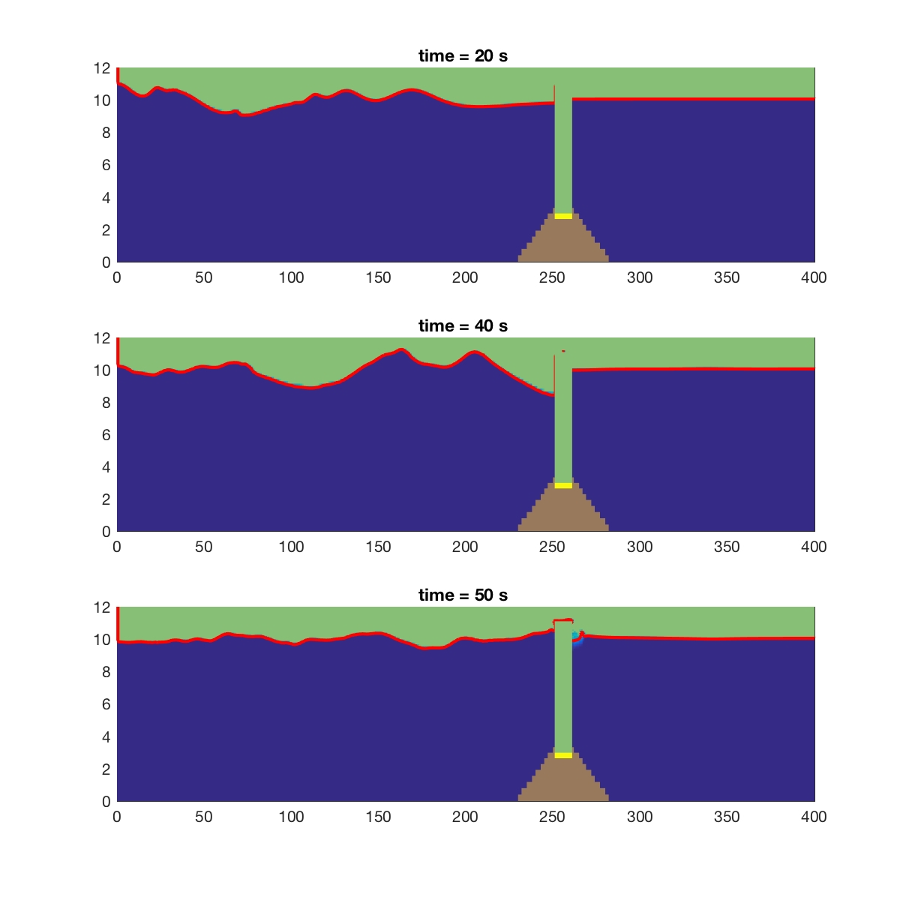
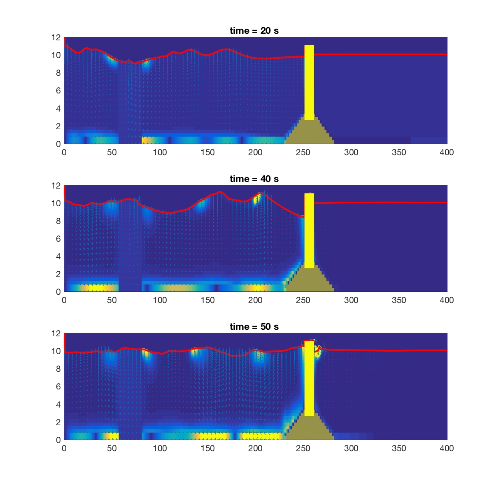
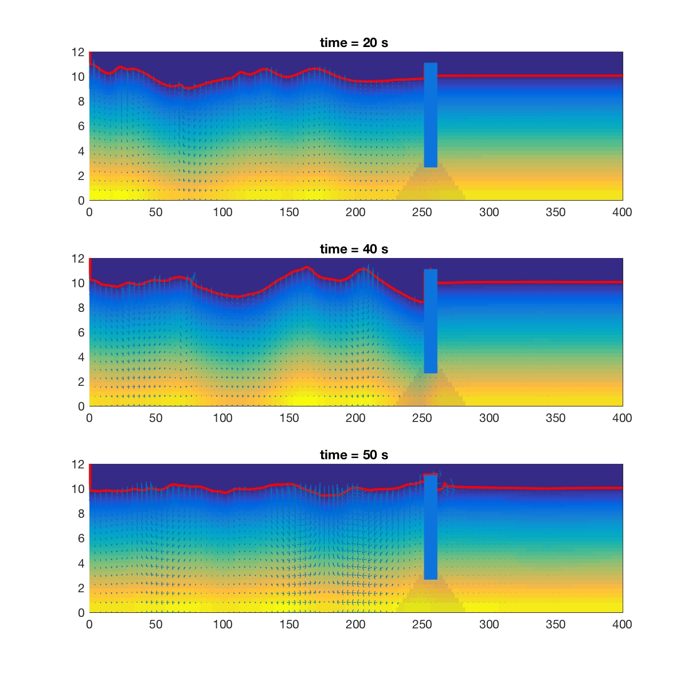

Irregular Waves
**************************************

* Numerical

.. code:: ruby

   $numparam
   0.0,0.01,150,0.5,0.05,1.0          = t_start,delt,twfin,prtdt,sfdt,utot
   6,3,1,1   = kl,kr,kt,kb
   $end

**kl = 6** for internal wavemaker

* Mesh

.. code:: ruby

   $mesh
   1,0,400.0,200.0,200,200          = nkx,xl(nkx+1),xc(nkx),nxl(nkx),nxr(nky) 
   1.0                          = dxmn(nkx)
   1,0.0,12.0,10.0,40,20        = nky,yl(nky+1),yc(nky),nyl(nky),nyr(nky)
   0.1           =dymn(nky)
   $end

* Free surface

.. code:: ruby

   $freesurf
   1                     =nfrsrf
   0.,0.0                =fa2(nfrsrf),fa1(nfrsrf)
   0.,-1.0               =fb2(nfrsrf),fb1(nfrsrf)
   0.,10.0,1              =fc2(nfrsrf),fc1(nfrsrf),ifh(nfrsrf)
   0.,0.                 =fd2(nfrsrf),fd1(nfrsrf)
   0.,0.                 =fe2(nfrsrf),fe1(nfrdrf)
   0.,0.                 =nxf(nfrsrf),mxf(nfrsrf)
   0.,0.                 =nyf(nfrsrf),myf(nfrsrf)
   10.0                   =flht
   $end

* Obstacle

.. code:: ruby

   $obstcl
   1    = nobstype
   3
   0,-0,0,1
   0,-10.5,1
   0,0.525,0,-1
   0,-120.75,0
   0,-0.525,0,-1
   0,147,0
   $end

* Wave parameters

.. code:: ruby

   $wave parameter$
   2.11,16.05,16.05,100      =amp,dep,depr,wavemk(100:spectral) 
   68, 71, 20, 30, 44, 12.5  =iS,iE,jS,jE,irregular, Tmean

* Other parameters, including turbulence model

.. code:: ruby

   $other parameters$
   4,0.00001,1,0,0,0,1,0       =kemode,roughness,nopen,npollutant,nrs,novertop,nfree,islip
   $end

