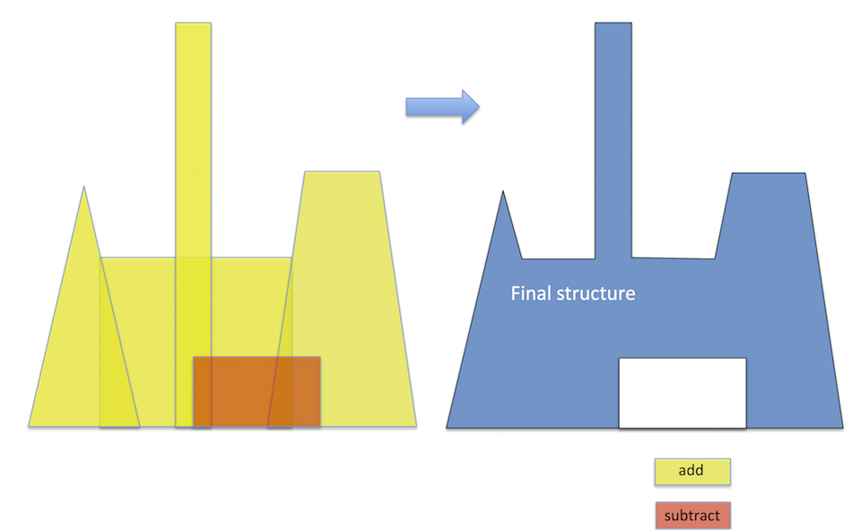

Obstacles--Simple Definition
*************************************

.. note:: Simple implementation using linear functions

The idea of the simple implementation is to combine multiple polygons to form a structure. The polygons can overlap each other. The priority is given to the polygons specified in later definitions. For example, if you make a subtraction earlier, then specify an addition which covers the subtracted area, the final structure will take the overlapped addition rather than subtraction. 

.. toctree::
   :maxdepth: 2
   :caption: Contents:

   setup_obs_simple_proc
   setup_obs_simple_lara
   setup_obs_simple_garv 