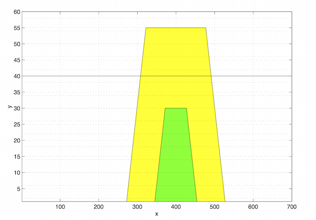

Initial Surface
**********************************

.. note:: If you are working on surface wave modeling, you don't need to look at the details. Just replace the **SURFACE** with the value of surface elevation (usually initial surface elevation) in the following code.  For comprehensive free surface setup,  you can refer to obstacles configuration.  

.. code:: ruby
   
   $freesurf
   1                     =nfrsrf
   0.,0.0                =fa2(nfrsrf),fa1(nfrsrf)
   0.,-1.0               =fb2(nfrsrf),fb1(nfrsrf)
   0.,SURFACE,1              =fc2(nfrsrf),fc1(nfrsrf),ifh(nfrsrf)
   0.,0.                 =fd2(nfrsrf),fd1(nfrsrf)
   0.,0.                 =fe2(nfrsrf),fe1(nfrdrf)
   0.,0.                 =nxf(nfrsrf),mxf(nfrsrf)
   0.,0.                 =nyf(nfrsrf),myf(nfrsrf)
   SURFACE                   =flht
   $end

For this case

.. code:: ruby
   
   $freesurf
   1                     =nfrsrf
   0.,0.0                =fa2(nfrsrf),fa1(nfrsrf)
   0.,-1.0               =fb2(nfrsrf),fb1(nfrsrf)
   0.,40,1              =fc2(nfrsrf),fc1(nfrsrf),ifh(nfrsrf)
   0.,0.                 =fd2(nfrsrf),fd1(nfrsrf)
   0.,0.                 =fe2(nfrsrf),fe1(nfrdrf)
   0.,0.                 =nxf(nfrsrf),mxf(nfrsrf)
   0.,0.                 =nyf(nfrsrf),myf(nfrsrf)
   40                   =flht
   $end

