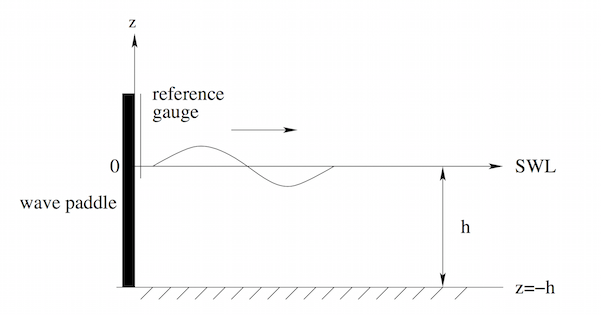
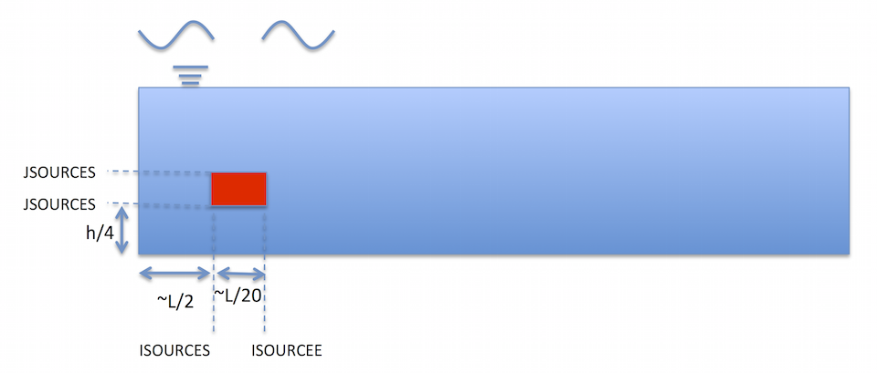

Wavemaker
**********************************

.. note:: There are more than 10 wavemakers implemented in the model. Here, we introduce two types of wavemakers which are the most useful in coastal/ocean engineering applications.

* **Left boundary wavemaker**

.. code:: ruby
   
   $wave parameter$
   0.5,10.0,10.0,4      =ht,dep,depr,wavemk(4:Stokes,24:cnoidal,34:linear) 
   8 1                   =T,areturn
   $end  

Definitions

 #. ht: wave height
 #. dep: inflow water depth (depth at wavemaker)
 #. depr: outflow water depth (set depr=dep for regular applications)
 #. wavemk: wavemaker types. The most useful types: 4:Stokes,24:cnoidal,34:linear
 #. T: wave period
 #. areturn: 1 for including the return flow induced by Stokes drift

  Waves are generated at the left boundary (except when wavemk=100, or when another type of condition, different to wave generation, is specified). In that case, the boundary has to be defined as **KL=6** (see section of Numerical Parameters).

* **Internal wavemaker**

  The internal wavemaker generates a system of waves that propagates in two directions. The top limit of the source function has to remain under the wave trough, and its vertical dimension has to be about half the depth. The source function has to be placed at a distance of ∼L/2 from the left boundary and at a distance of ∼h/3 from the bottom boundary. Its width has to be <4 cells or ∼L/20, its height is recommended to be around h/4 

.. code:: ruby

   $wave parameter$
   0.128,0.4,0.4,100   <==aa,h0,h0r,wavemk(100:internal) 
   147,156,37,68,44,1 <== isourceS,isourceE,jsourceS,jourceE,
                           type(44:irregular),areturn
   $end 

